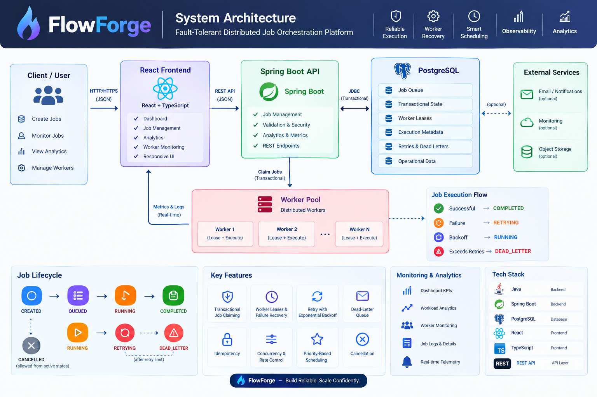
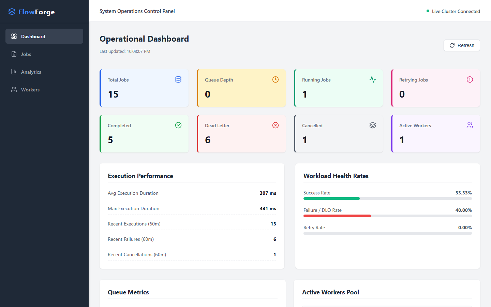
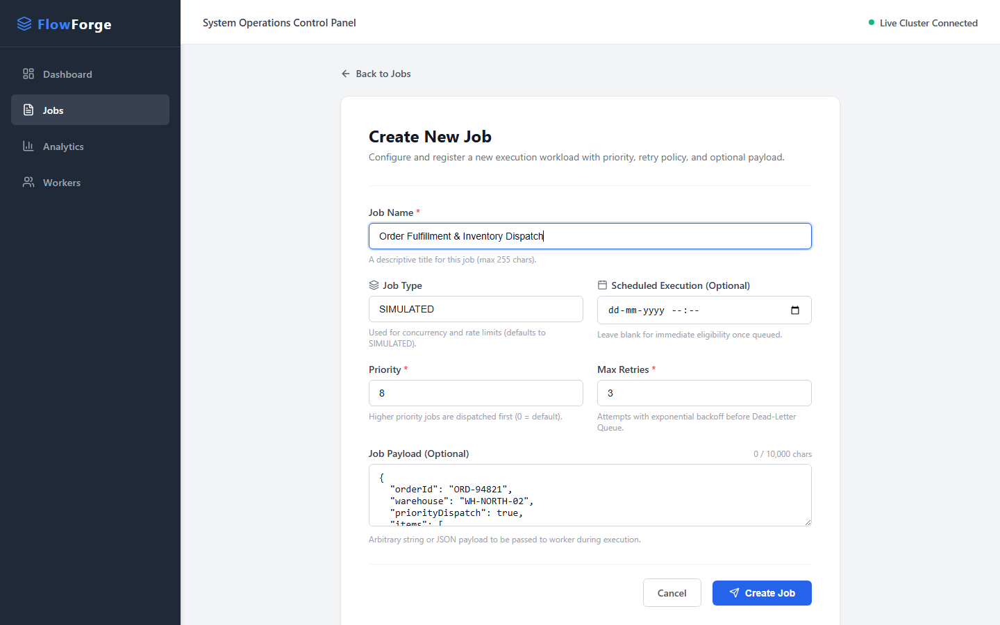
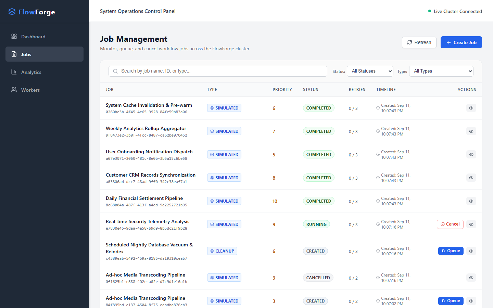
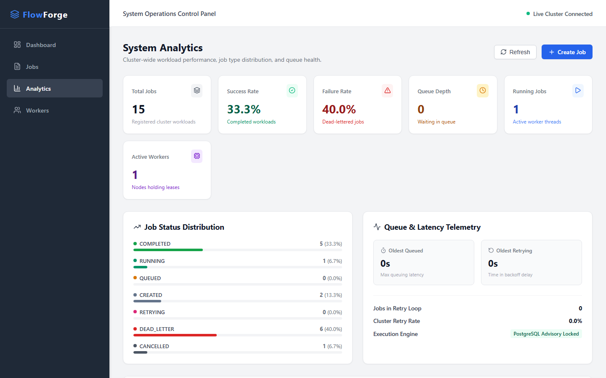
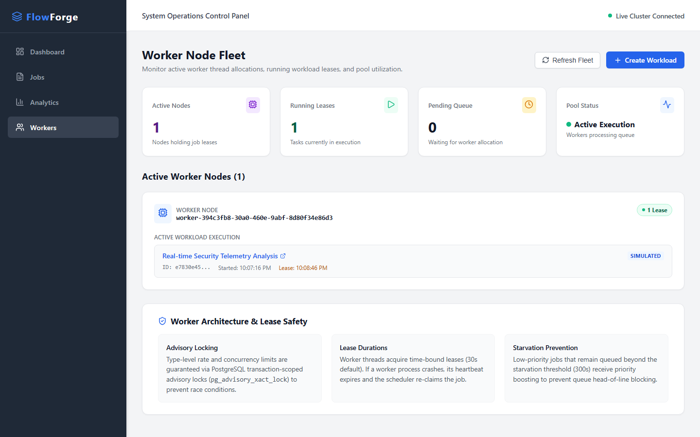
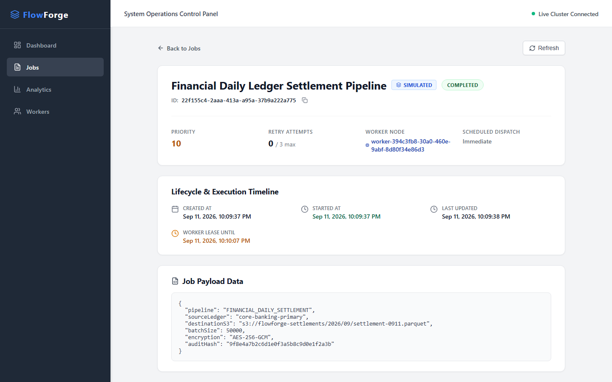
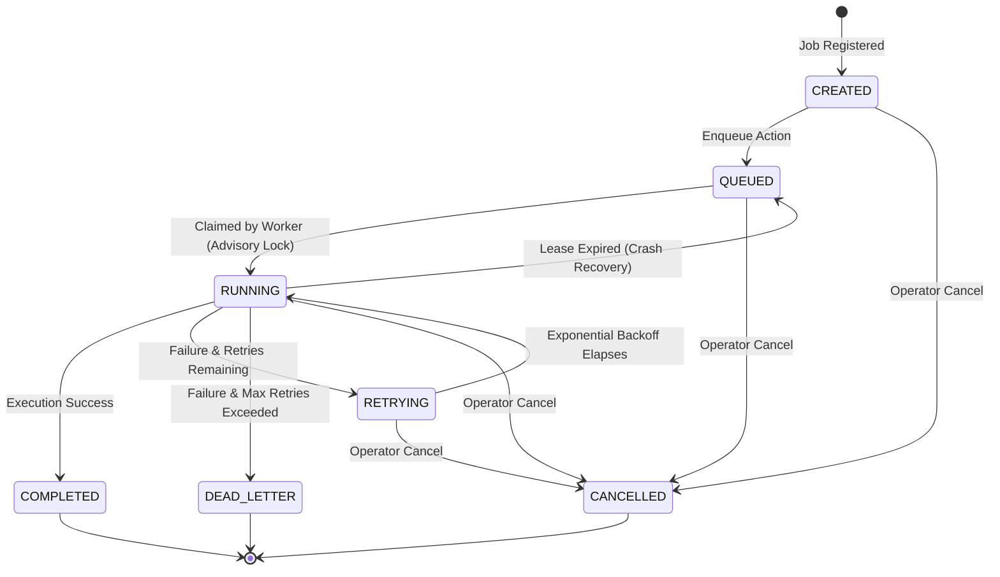

# FlowForge

> **A Fault-Tolerant, Distributed Job Orchestration and Execution Platform** built with Spring Boot, PostgreSQL, React, and TypeScript.

[](https://openjdk.org/)
[](https://spring.io/projects/spring-boot)
[](https://www.postgresql.org/)
[](https://react.dev/)
[](https://www.typescriptlang.org/)
[](https://vitejs.dev/)
[](LICENSE)

FlowForge is a production-inspired distributed job orchestration engine designed for reliable, transactional workload scheduling and execution across distributed worker threads. By leveraging PostgreSQL transactional row-level locking (`FOR UPDATE SKIP LOCKED`) and advisory locks (`pg_advisory_xact_lock`), FlowForge prevents race conditions during job claiming while providing heartbeat-based worker lease tracking, automated crash recovery, exponential backoff retries, dead-letter queue (DLQ) containment, and real-time observability telemetry.

---

## Table of Contents

- [System Architecture](#system-architecture)
- [Architecture Diagram](#architecture-diagram)
- [Core Technical Highlights](#core-technical-highlights)
- [Product Showcase](#product-showcase)
  - [Dashboard](#dashboard)
  - [Job Management](#job-management)
  - [Analytics & Monitoring](#analytics--monitoring)
  - [Worker Monitoring](#worker-monitoring)
  - [Job Details](#job-details)
- [Job Lifecycle State Machine](#job-lifecycle-state-machine)
- [REST API Reference](#rest-api-reference)
- [Tech Stack](#tech-stack)
- [Configuration Reference](#configuration-reference)
- [Quickstart & Local Setup](#quickstart--local-setup)
- [Project Status](#project-status)

---

## System Architecture

FlowForge follows a decoupled, resilient client-server architecture designed for high concurrency and strict operational safety:

1. **Client & Presentation Tier (React + TypeScript):** A responsive administrative dashboard providing real-time fleet telemetry, interactive job dispatch forms, filtered audit lists, execution timeline inspections, and worker lease status.
2. **Application & Orchestration Tier (Spring Boot REST API):** Exposes validated REST endpoints protected by token authentication (`X-API-KEY`). Manages job lifecycle validation, scheduling queues, priority calculations, and telemetry rollups.
3. **Storage & Concurrency Tier (PostgreSQL):** Serves as both the durable persistence layer and the high-throughput synchronization coordinator. Uses pessimistic row locking (`FOR UPDATE SKIP LOCKED`) and transaction-scoped advisory locks to coordinate job claiming across concurrent worker threads without external coordination services.
4. **Distributed Execution Tier (Worker Pool):** Autonomous background worker threads claim queued jobs, acquire time-bound leases, refresh heartbeats during active execution, and gracefully recover expired leases left behind by crashed or stalled nodes.

---

## Architecture Diagram

<p align="center">
  
</p>
<p align="center">
  <em>Figure 1: FlowForge Fault-Tolerant Distributed Job Orchestration Architecture</em>
</p>

The architecture diagram highlights the transactional relationship between client requests, the Spring Boot orchestration layer, PostgreSQL transactional locking mechanisms, distributed worker threads holding time-bound leases, and the real-time telemetry streaming back to the operations dashboard.

---

## Core Technical Highlights

| Mechanism | Technical Implementation | Operational Benefit |
| :--- | :--- | :--- |
| **Transactional Job Claiming** | `SELECT ... FOR UPDATE SKIP LOCKED` inside an isolated transaction (`REQUIRES_NEW`). | Eliminates race conditions and duplicate executions across parallel worker threads. |
| **Concurrency & Rate Control** | PostgreSQL transaction-scoped advisory locks (`pg_advisory_xact_lock(hashtext(job_type))`). | Enforces type-level concurrency and rate limits at the database level. |
| **Worker Leases & Heartbeats** | 30-second time-bound leases with active 10-second background heartbeat renewals (`extendLease`). | Ensures job ownership visibility; allows workers to run long workloads safely. |
| **Automated Crash Recovery** | Scheduled sweeper checking `leaseUntil < now` for jobs in `RUNNING` status every 5 seconds. | Rescues stalled or crashed worker jobs automatically without manual intervention. |
| **Priority Scheduling** | Composite index ordering (`priority DESC, scheduled_at ASC, created_at ASC`). | Dispatches mission-critical workloads ahead of routine bulk tasks. |
| **Starvation Prevention** | Dynamic priority boosting for low-priority jobs queued past the starvation threshold (300s). | Prevents queue head-of-line blocking under sustained heavy workload. |
| **Exponential Backoff & DLQ** | Delay formula: $\text{delay} = \text{baseDelay} \times 2^{\text{retryCount}}$. Jobs exceeding `maxRetries` transition to `DEAD_LETTER`. | Prevents cascading retry storms and isolates corrupted payloads for root-cause analysis. |
| **State Machine Idempotency** | Strict transition guards (`CREATED` $\rightarrow$ `QUEUED` $\rightarrow$ `RUNNING` $\rightarrow$ `COMPLETED` / `DEAD_LETTER`). | Rejects invalid operations (e.g., cancelling completed jobs) with HTTP 409 Conflict. |
| **API Security & Validation** | `ApiKeyInterceptor` validating `X-API-KEY` header; Jakarta Bean Validation on input DTOs. | Protects operational endpoints and enforces data integrity before database insertion. |

---

## Product Showcase

### Dashboard

The **Operational Dashboard** provides centralized visibility across the entire job cluster. It features 8 color-coded KPI metric cards, workload health rates with progress meters, execution duration statistics (average and maximum execution latencies), queue depth counters, and active worker node allocations.

<p align="center">
  
</p>
<p align="center">
  <em>Figure 2: Real-time operational control panel displaying cluster health, KPIs, and workload health rates.</em>
</p>

---

### Job Management

FlowForge includes an interactive workload dispatcher and an administrative registry for managing batch and background jobs.

#### 1. Job Dispatch Form
Allows operators to configure new execution workloads with custom names, job types (e.g., `SIMULATED`, `REPORT_GENERATION`, `DATA_SYNC`, `CLEANUP`), execution priority tiers, retry policies, scheduling dates, and structured JSON payloads.

<p align="center">
  
</p>
<p align="center">
  <em>Figure 3: Production-ready job dispatch form with field validation and JSON payload configuration.</em>
</p>

#### 2. Job Registry Table
A multi-state table showing real-time job execution states (`COMPLETED`, `RUNNING`, `CREATED`, `CANCELLED`, `DEAD_LETTER`), priority badges, retry counts, timestamp audit trails, and contextual action buttons (`Queue`, `Cancel`, `View Details`).

<p align="center">
  
</p>
<p align="center">
  <em>Figure 4: Workload management registry with live search, status filtering, and administrative actions.</em>
</p>

---

### Analytics & Monitoring

The **System Analytics** view delivers deep-dive telemetry on cluster throughput and stability. It displays workload ratios (success rate, failure/DLQ rate, retry rate), status distribution visual meters, queue latency counters (oldest queued and oldest retrying jobs), and execution engine locking guarantees.

<p align="center">
  
</p>
<p align="center">
  <em>Figure 5: Cluster telemetry analytics showing status distribution, throughput ratios, and queue latency.</em>
</p>

---

### Worker Monitoring

The **Worker Node Fleet** console monitors active worker allocations, held leases, and thread pool capacity. Operators can inspect which worker node holds a specific job lease, verify lease expiration timestamps, and review concurrency and starvation prevention guarantees.

<p align="center">
  
</p>
<p align="center">
  <em>Figure 6: Worker fleet console showing active node allocations, running job leases, and lease expiration timing.</em>
</p>

---

### Job Details

The **Job Details Inspector** provides deep auditability for individual workloads. It exposes granular execution lifecycle timelines (`CREATED_AT`, `STARTED_AT`, `LAST_UPDATED`, `LEASE_UNTIL`), assigned worker identity, retry history, error diagnostic logs, and serialized JSON execution payloads.

<p align="center">
  
</p>
<p align="center">
  <em>Figure 7: Workload audit inspector displaying execution timeline, assigned worker node, and structured payload.</em>
</p>

---

## Job Lifecycle State Machine



| State | Description | Allowed Transitions |
| :--- | :--- | :--- |
| `CREATED` | Job registered in database; awaiting dispatch or manual enqueue. | `QUEUED`, `CANCELLED` |
| `QUEUED` | Job ready in priority queue; eligible for worker claiming. | `RUNNING`, `CANCELLED` |
| `RUNNING` | Claimed by an active worker thread with a valid lease. | `COMPLETED`, `RETRYING`, `DEAD_LETTER`, `QUEUED` (recovery), `CANCELLED` |
| `RETRYING` | Execution failed; waiting for exponential backoff window to expire. | `RUNNING`, `CANCELLED` |
| `COMPLETED` | Execution succeeded; terminal state. | *None* |
| `DEAD_LETTER` | Exceeded max retry attempts; quarantined for inspection; terminal state. | *None* |
| `CANCELLED` | Aborted by operator or administrator; terminal state. | *None* |

---

## REST API Reference

All `/api/**` endpoints require authentication via the `X-API-KEY` header when an API key is configured. Swagger UI is available at `/swagger-ui/index.html`.

| Method | Endpoint | Description | Status Codes |
| :--- | :--- | :--- | :--- |
| `POST` | `/api/jobs` | Register a new job with priority, retries, and optional payload. | `201 Created`, `400 Bad Request` |
| `GET` | `/api/jobs` | Retrieve all jobs (supports status and type filtering). | `200 OK` |
| `GET` | `/api/jobs/{id}` | Retrieve comprehensive details for a specific job. | `200 OK`, `404 Not Found` |
| `PUT` | `/api/jobs/{id}/queue` | Transition a `CREATED` job to `QUEUED` state. | `200 OK`, `409 Conflict` |
| `POST` | `/api/jobs/{id}/cancel` | Cancel an active job (`QUEUED`, `RETRYING`, or `RUNNING`). | `200 OK`, `409 Conflict` |
| `GET` | `/api/analytics/workload` | Cluster workload totals, status counts, success/failure rates. | `200 OK` |
| `GET` | `/api/analytics/workload/types` | Job counts and metrics grouped by job type. | `200 OK` |
| `GET` | `/api/analytics/workers` | Active worker nodes, running leases, and held job IDs. | `200 OK` |
| `GET` | `/api/analytics/queue` | Current queue depth, oldest queued latency, and retrying jobs. | `200 OK` |
| `GET` | `/actuator/health` | Spring Boot Actuator application and database health check. | `200 OK` |

---

## Tech Stack

| Layer | Technology | Version | Purpose |
| :--- | :--- | :--- | :--- |
| **Backend Runtime** | Java OpenJDK | 21 (LTS) | Core backend language runtime |
| **Application Framework** | Spring Boot | 3.3.x | REST API, scheduling, dependency injection |
| **Persistence / ORM** | Spring Data JPA / Hibernate | 6.x | Relational mapping, pessimistic locking |
| **Database** | PostgreSQL | 16 | ACID storage, `FOR UPDATE SKIP LOCKED`, advisory locks |
| **API Documentation** | Springdoc OpenAPI | 2.5.0 | Automated OpenAPI 3.0 specs and Swagger UI |
| **Frontend Framework** | React | 19.2.x | Component-driven administrative UI |
| **Type Safety** | TypeScript | 5.x | Static typing for components and API contracts |
| **Build & Bundler** | Vite | 8.x | High-speed ESM development server and production bundler |
| **Routing** | React Router DOM | 7.x | Client-side SPA navigation |
| **Icons & Design** | Lucide React | 1.x | Clean iconography across tables, badges, and cards |
| **Linter** | Oxlint | 1.x | High-performance static analysis and linting |

---

## Configuration Reference

### Backend (`flowforge-backend/src/main/resources/application.properties`)

```properties
# Server
server.port=8081

# PostgreSQL Connection
spring.datasource.url=${DB_URL:jdbc:postgresql://localhost:5432/flowforge}
spring.datasource.username=${DB_USERNAME:postgres}
spring.datasource.password=${DB_PASSWORD:password}
spring.datasource.driver-class-name=org.postgresql.Driver

# Security
flowforge.security.api-key=${FLOWFORGE_API_KEY:}

# Scheduler & Worker Pool
flowforge.scheduler.poll-interval-ms=1000
flowforge.scheduler.batch-size=5
flowforge.worker.core-pool-size=4
flowforge.worker.max-pool-size=8
flowforge.worker.queue-capacity=100

# Leases & Recovery
flowforge.retry.base-delay-ms=2000
flowforge.worker.lease-duration-ms=30000
flowforge.worker.heartbeat-interval-ms=10000
flowforge.worker.recovery-interval-ms=5000
```

### Frontend (`flowforge-frontend/.env`)

```env
VITE_API_BASE_URL=http://localhost:8081
VITE_API_KEY=your_api_key_here
```

---

## Quickstart & Local Setup

### Prerequisites

- **Java JDK 21+**
- **Node.js 20+** and **npm 10+**
- **PostgreSQL 15+** running locally on port 5432

### 1. Database Initialization

Create the PostgreSQL database for FlowForge:

```sql
CREATE DATABASE flowforge;
```

### 2. Backend Setup

```bash
cd flowforge-backend

# Set environment variables (or rely on defaults in application.properties)
export FLOWFORGE_API_KEY="your_api_key_here"
export DB_USERNAME="postgres"
export DB_PASSWORD="your_password"

# Run tests
./mvnw clean test

# Start the Spring Boot application
./mvnw spring-boot:run
```

The backend starts at `http://localhost:8081`. Swagger UI is accessible at `http://localhost:8081/swagger-ui/index.html`.

### 3. Frontend Setup

```bash
cd flowforge-frontend

# Install dependencies
npm install

# Run linter and type-checking
npm run lint
npm run build

# Start the Vite development server
npm run dev
```

The frontend will be available at `http://localhost:5173`.

---

## Project Status

- **Milestones Completed:** Backend M1–M9 (Architecture, PostgreSQL advisory locking, worker lease management, recovery scheduler, exponential backoff, DLQ, OpenAPI, API key security) and Frontend F1–F9 (Dashboard, Operations, Create Job, Job Management, Job Details, System Analytics, Worker Fleet Monitoring, UX & Responsive Polish, Final E2E Integration Audit).
- **Backend Test Suite:** 79/79 automated tests passing with zero failures, zero errors, and zero skipped (`BUILD SUCCESS`).
- **Frontend Code Quality:** Clean TypeScript compilation with 0 linter warnings or errors (`oxlint` PASS, `vite build` PASS).
- **End-to-End Verification:** Full lifecycle execution verified in browser across desktop, tablet, and mobile viewports.
- **Production Readiness:** **VERIFIED & PASS**.
